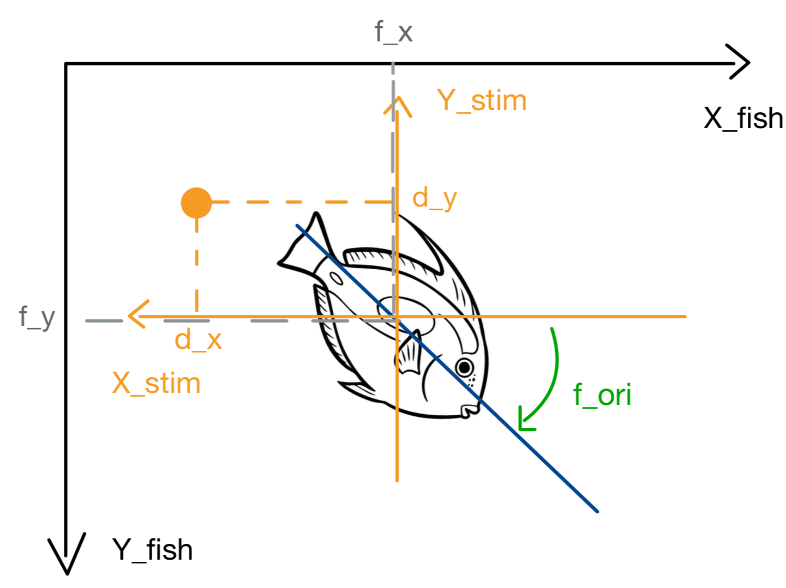
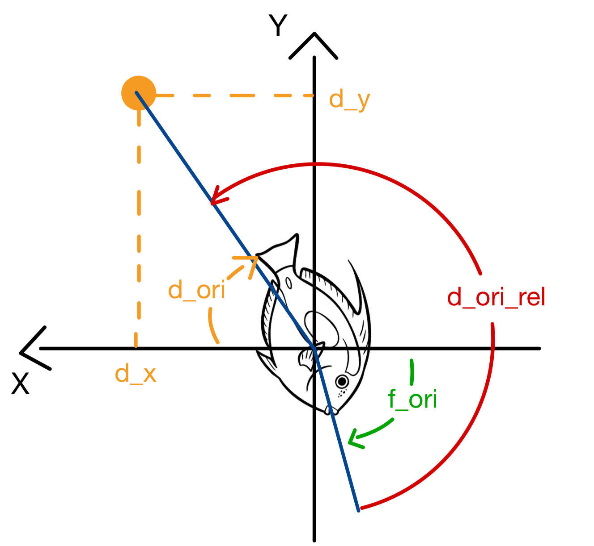
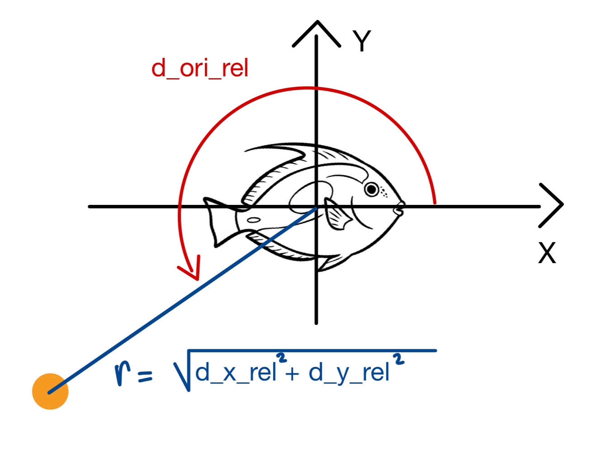

# Coordinate and Angle Transformations — Zebrafish Project


This document explains how global (world-centered) coordinates of fish and stimuli are converted into egocentric coordinates 
(centered and oriented on the fish), and how relative angles between each stimulus and the fish’s heading are computed. The goal is to compute $d_{ori,\text{rel}}$, the angle between the orientation of the fish and the vector ($d_{x}$, $d_{y}$) (from fish center to position of stimulus).

---

## Input Data

We start with the dataset preprocessed_data.csv extracted from AllFish_GsizeMotionSingle.ipynb

Each frame of the dataset contains:
- For each fish *fₙ*:  
  - position `(fₙ_x, fₙ_y)`  
  - orientation `fₙ_ori`  
The fish orientation is measured in radians, increasing clockwise, with 0 corresponding to the rightward direction. 
- For each stimulus *dₖ*:  
  - position `(dₖ_x, dₖ_y)`  
  - activity flag `dₖ_stim` (0 / "none" means no stimulus)
Dot coordinates in millimeters, relative to the fish centroid, Left side → positive x values

There are typically 8 stimuli (`d0`–`d7`) and 15 fish (`f0`–`f14`).

There are typically 8 stimuli (`d0`–`d7`) and 15 fish (`f0`–`f14`).

For simplicity we will focus here on 1 fish and 1 stimulus and therefore denotes `(f_x, f_y, f_ori)`and `(d_x, d_y)`.

#### <center> Figure 1 – Experiment represented with initial data
<p align="center">
  
</p>


---

## 1/ From Global to Egocentric Coordinates


We want to compute the orientation of stimulus d_ori : The naive formula
$$
d_{\text{ori}} = \arctan\left(\frac{d_{y}}{d_{x}}\right)
$$
is incorrect for our use case, because the standard arctangent (arctan) only works in one quadrant at a time.
It ignores the sign of both coordinates, which leads to wrong angles when the stimulus is in the top-right or bottom-right quadrants.

We instead use the two-argument function atan2(y, x), which handles the signs correctly and returns the full directional angle of the vector:

$$
d_{\text{ori}} = \text{arctan2}\left(d_{y},, d_{x}\right)
$$

However, arctan2 returns an angle in the range $(-\pi,\, \pi]$.
Since fish orientations $(f_{\text{ori}})$ are defined between 0 and $2\pi$,
we convert our stimulus orientation to the same range using:

$$
d_{\text{ori}} = \big(\text{arctan2}(d_{y},, d_{x}) + 2\pi \big) \bmod 2\pi
$$

This centers the reference frame on the fish.

 **Code implementation**
```python
d_ori = (np.arctan2(dy, dx) + 2*np.pi) % (2*np.pi)
```

#### <center> Figure 2 – Experiment centered on fish 
<p align="center">
  
</p>

Now, we want to simplify the next computations by setting the same baseline for the 2 angles. For this we will measure $d_{\text{ori}}$ from the right of the x axis. To do this if  $d_{ori} < \pi$ therefore $d_{ori} = d_{ori} + \pi$, and if $d_{ori} >= \pi$ therefore $d_{ori} = d_{ori} -\pi$.

This operation can also be written more compactly as $(d_{\text{ori}} - \pi) \bmod 2\pi$, which ensures a continuous angular mapping and avoids discontinuities around $\pi$ while preserving the same baseline alignment.

 **Code implementation**
```python
d_ori = (d_ori - np.pi) % (2*np.pi)
```


#### <center>  Figure 3 : Experiment centered on fish with d_ori measured from same baseline than f_ori
<p align="center">
  
</p>

Here

$$
d\_{\text{ori\_rel}} = d\_{\text{ori}} - f\_{\text{ori}}
$$

We want $d_{ori,\text{rel}}$ to be between 0 and $2\pi$, and increasing in the trigonometric sens to respect standard polar coordinates norm.

$$
d\_{\text{ori\_rel}} = 2\pi - d\_{\text{ori\_rel}}
$$

$$
d_{\text{ori\_rel}} = (d_{\text{ori\_rel}} + 2\pi \big) \bmod 2\pi
$$

Then we can compute radius and we have our 2 coordinates of the egocentric polar coordinates system.

$$
r = \sqrt{dx_{rel}^2 + dy_{rel}^2}
$$

🧩 **Code implementation**
```python
d_ori_rel = d_ori - f_ori
d_ori_rel = 2*np.pi - d_ori_rel
d_ori_rel = (d_ori_rel + 2*np.pi) % (2*np.pi)

r = np.sqrt(x**2 + y**2)
```

#### <center>  Figure 4 : Experiment in egocentric polar coordinates
<p align="center">
  
</p>

---

## 7️⃣ Common Pitfalls

- Not centering coordinates before rotation.  
- Mixing angle directions (clockwise vs counter-clockwise).  
- Forgetting to wrap $[-\pi, \pi]$.  
- Using `arctan(y, x)` instead of `arctan2(y, x)` (which handles signs correctly).  
- Ignoring cases where $d_k^{stim} = "none"$ or NaN coordinates.

---

## 8️⃣ Conclusion

This transformation ensures that every frame is represented  
in a consistent egocentric coordinate system, allowing meaningful  
comparison of fish–stimulus geometry across time.

If the density plots still appear inconsistent (e.g. too flat or biased front/back),  
the issue likely lies in:
- sign conventions (clockwise vs counter-clockwise), or  
- rotation direction (you might need to rotate by `+f_ori` instead of `-f_ori`).

---

